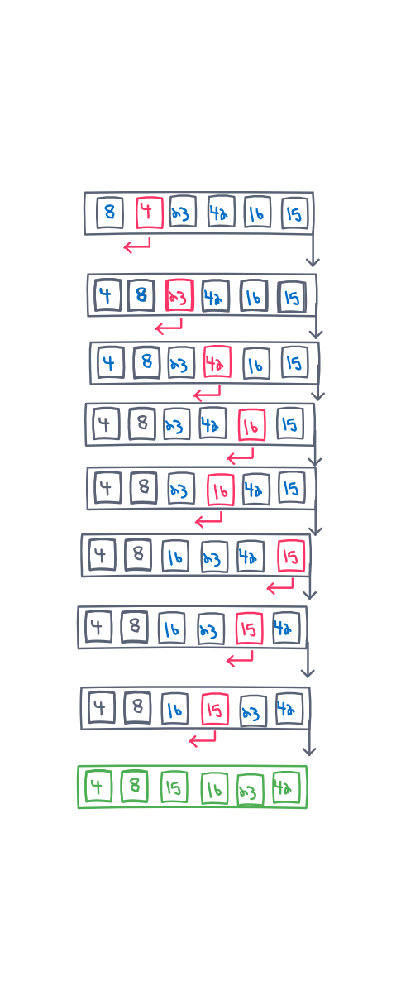

# Insertion Sort
Trace the algorithm by stepping through the process with the provided sample array.

`[8,4,23,42,16,15]`

```
InsertionSort(int[] arr)

    FOR i = 1 to arr.length

      int j <-- i - 1
      int temp <-- arr[i]

      WHILE j >= 0 AND temp < arr[j]
        arr[j + 1] <-- arr[j]
        j <-- j - 1

      arr[j + 1] <-- temp
```
```javascript
let arr = [8,4,23,42,16,15]
function InsertionSort (){
for (let i = 1; i < arr.length; i++){
  let j = i - 1;
  let temp = arr[i];
  while (j >= 0 && temp < arr[j]){
    arr[j + 1] = arr[j];
    j = j - 1;
  }
  arr[j + 1] = temp;
}
return arr;
}
```

## Whiteboard Process


## Approach & Efficiency
- Insertion sort runs in O(n²) of time.This typically isn’t very effective and should not be used for large lists, but small list is ok to use insertion sort.

- it only uses O(1) constant space. Insertion sort yor array in-place

## Solution
- We will first take a less than value to compare with other values in the array to sort.
- moving from left to right over an array
- current item as a `temp`, and then search through the items to the left of that item in the array for the place that the `temp` should go. This means that the sub-array to the left of the current `temp` will already be sorted, and will remain sorted after every iteration of insertion sort.

[8,4,23,42,16,15] 

- Starting with the element at index 1, `4`, insertion sort will look at the sub-array to the left of index 1 (which is our current `temp`) for the position where the key should be placed. Because `8` is greater than `4`, it knows that `4` should be placed before `8`. After the first iteration of insertion sort, our array will look like this: [4,8,23,42,16,15] and our new `temp` will be at index 2 which holds the value of `23`. This process will repeat until the last value is compared and sorted, and then insertion sort will return the sorted array. [4,8,15,16,23,42]
