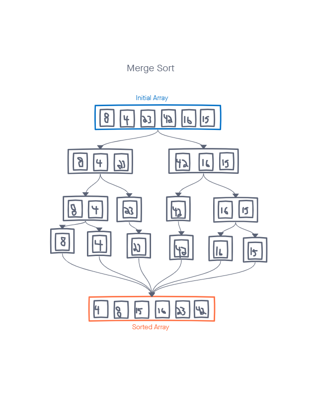

# Merge Sort
Merge sort uses the concept of divide-and-conquer to sort the given list of elements. It breaks down the problem into smaller subproblems until they become simple enough to solve directly.

## Challenge Summary
Implementation: trace the algorithm by stepping through the process with the provided sample array. 
`[8,4,23,42,16,15]`

## Whiteboard Process


## Approach & Efficiency

1. Split the given list into two halves 
2. Continue dividing the subarrays until you are left with only single element arrays.
3. Starting with the single element arrays, merge the subarrays so that each merged subarray is sorted.
4. Repeat step 3 until the single elements end up with a sorted new array.

The time time complexity of Merge Sort is O(nlogn)
The space complexity of the merge sort is O(n)

## Solution
```pseudocode
ALGORITHM Mergesort(arr)
    DECLARE n <-- arr.length

    if n > 1
      DECLARE mid <-- n/2
      DECLARE left <-- arr[0...mid]
      DECLARE right <-- arr[mid...n]
      // sort the left side
      Mergesort(left)
      // sort the right side
      Mergesort(right)
      // merge the sorted left and right sides together
      Merge(left, right, arr)

ALGORITHM Merge(left, right, arr)
    DECLARE i <-- 0
    DECLARE j <-- 0
    DECLARE k <-- 0

    while i < left.length && j < right.length
        if left[i] <= right[j]
            arr[k] <-- left[i]
            i <-- i + 1
        else
            arr[k] <-- right[j]
            j <-- j + 1

        k <-- k + 1

    if i = left.length
       set remaining entries in arr to remaining values in right
    else
       set remaining entries in arr to remaining values in left
```
```javascript
function Mergesort(arr) {
  let n = arr.length;

  if (n > 1) {
    let mid = n/2;
    let left = arr.slice(0, mid);
    let right = arr.slice(mid, n);

    Mergesort(left);
    Mergesort(right);
    Merge(left, right, arr);
  }
}

function Merge(left, right, arr) {
  let i = 0;
  let j = 0;
  let k = 0;

  while (i < left.length && j < right.length) {
    if (left[i] <= right[j]) {
      arr[k] = left[i];
      i ++;
    } else {
      arr[k] = right[j];
      j = j + 1;
    }

    k = k + 1;
  }

  if (i = left.length) {
    Merge(MergeSort(right))
  } else {
    Merge(MereSort(left))
  }
}

