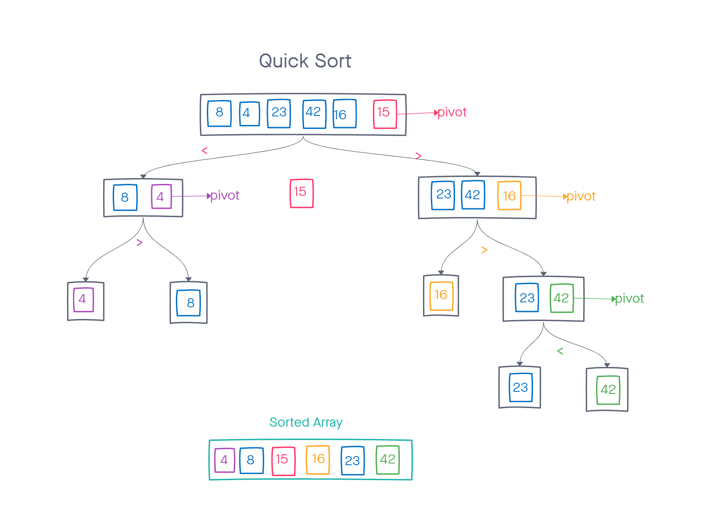

# Challenge Summary
trace the algorithm by stepping through the process with the provided sample array.

## Whiteboard Process


## Approach & Efficiency
1. Select a value of the array. We will call it the `pivot`. The `pivot` can be the first or last value in the array.
2. Need a function call `partition` to rearrange the values of the array so that all the values to the left of the `pivot` are smaller than the `pivot` and all the values to the right are greater than the `pivot`. 
3. Repeat this process individually for the left and right side of the `pivot`, until the array is sorted.

The worst-case time complexity of Quick Sort is O(n2)

## Solution
```pseudocode
ALGORITHM QuickSort(arr, left, right)
    if left < right
        // Partition the array by setting the position of the pivot value
        DEFINE position <-- Partition(arr, left, right)
        // Sort the left
        QuickSort(arr, left, position - 1)
        // Sort the right
        QuickSort(arr, position + 1, right)

ALGORITHM Partition(arr, left, right)
    // set a pivot value as a point of reference
    DEFINE pivot <-- arr[right]
    // create a variable to track the largest index of numbers lower than the defined pivot
    DEFINE low <-- left - 1
    for i <- left to right do
        if arr[i] <= pivot
            low++
            Swap(arr, i, low)

     // place the value of the pivot location in the middle.
     // all numbers smaller than the pivot are on the left, larger on the right.
     Swap(arr, right, low + 1)
    // return the pivot index point
     return low + 1

ALGORITHM Swap(arr, i, low)
    DEFINE temp;
    temp <-- arr[i]
    arr[i] <-- arr[low]
    arr[low] <-- temp
```
```javascript
'use strict';

let arr = [8, 4, 23, 42, 16, 15];

function quickSort(arr, left, right) {
  if (left < right) {
    let position = partition(arr, left, right);
    quickSort(arr, left, position - 1);
    quickSort(arr, position + 1, right);
  }
}

function partition(arr, left, right) {
  let pivot = arr[right];
  let low = left - 1;
  for (let i = left; i < right; i++) {
    if (arr[i] <= pivot) {
      low++;
      swap(arr, i, low);
    }
  }
  swap(arr, right, low + 1);

  return low + 1;
}

function swap(arr, i, low) {
  let temp;
  temp = arr[i];
  arr[i] = arr[low];
  arr[low] = temp;
}

quickSort(arr);
console.log(quickSort(arr));
```    

