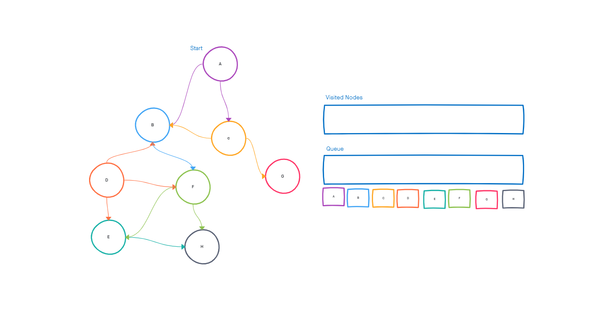

# Graphs
A graph is a common data structure that consists of a finite set of nodes (or vertices) and edges. The edges connect the vertices to form a network. An edge can be uni-directional or bi-directional. Edges are also known as arrows in a directed graph and may contain values that show the required cost to traverse from one vertex to another.

## Challenge
New Implementation

## Approach & Efficiency

### Traversals

#### Breadth First
1. `Enqueue` the declared start node into the Queue.
2. Create a loop that will run while the node still has nodes present.
3. `Dequeue` the first node from the queue
4. if the `Dequeue'd` node has unvisited child nodes, add the unvisited children to visited set and insert them into the queue.

### Big O
Storing a graph as an adjacency list has a space complexity of O(n), where n is the sum of vertices and edges. 
Adding a vertex from a graph adjacency list is: O(1)
Adding a edge from a graph adjacency list is: O(1)

## UML

## API
The graph would be represented as an adjacency list, and include the following methods:

- add node
  - Arguments: value
  - Returns: The added node
  - Add a node to the graph

- add edge
  - Arguments: 2 nodes to be connected by the edge, weight (optional)
  - Returns: nothing
  - Adds a new edge between two nodes in the graph
  - If specified, assign a weight to the edge
  - Both nodes should already be in the Graph

- get nodes
  - Arguments: none
  - Returns all of the nodes in the graph as a collection (set, list, or similar)

- get neighbors
  - Arguments: node
  - Returns a collection of edges connected to the given node
    - Include the weight of the connection in the returned collection

- size
  - Arguments: none
  - Returns the total number of nodes in the graph

## Testing

Tests to prove the following functionality:

1. Node can be successfully added to the graph
2. An edge can be successfully added to the graph
3. A collection of all nodes can be properly retrieved from the graph
4. All appropriate neighbors can be retrieved from the graph
5. Neighbors are returned with the weight between nodes included
6. The proper size is returned, representing the number of nodes in the graph
7. A graph with only one node and edge can be properly returned
8. An empty graph properly returns null
