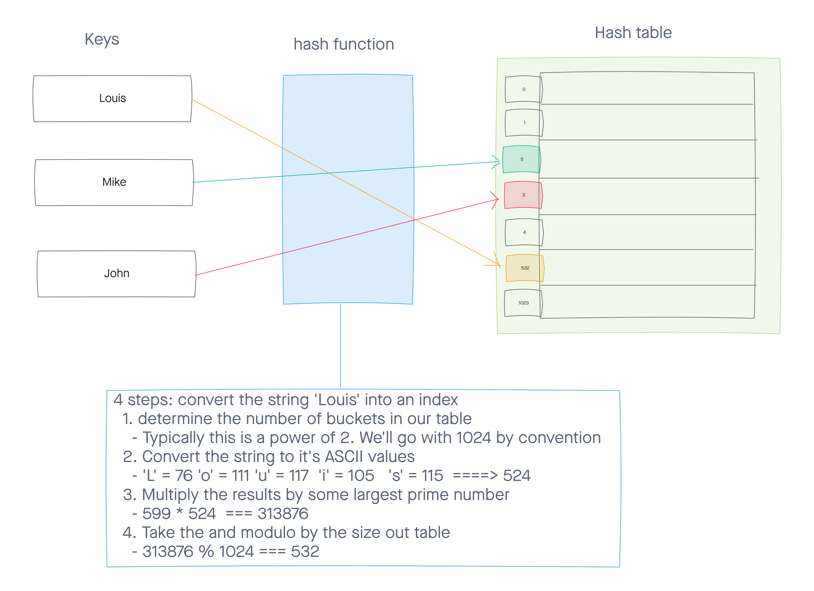

# Hashtables
Hash table is a data structure that implements an associative array abstract data type, a structure that can map keys to values. A hash table uses a hash function to compute an index, also called a hash code, into an array of buckets or slots, from which the desired value can be found.

## Challenge
New Implementation

## Approach & Efficiency
- searching for the element takes the same amount of time as searching for the first element of an array, which is a constant time or O(1)

- hash table store the information by the hash value . so if there's no collision , it would take O(1).  

## API

### Feature Tasks

1. Implement a Hashtable Class with methods

  - add()
    - Arguments: key, value
    - Returns: nothing
    - This method should hash the key, and add the key and value pair to the table, handling collisions as needed.

  - get()
    - Arguments: key
    - Returns: Value associated with that key in the table

  - contains()
    - Arguments: key
    - Returns: Boolean, indicating if the key exists in the table already.

  - hash()
    - Arguments: key
    - Returns: Index in the collection for that key

2. Write a function called repeated word that finds the first word to occur more than once in a string

  - repeatedWord()
    - Arguments: string
    - Return: string

## Testing

1. Adding a key/value to your hashtable results in the value being in the data structure 

2. Retrieving based on a key returns the value stored

3. Successfully returns null for a key that does not exist in the hashtable

4. Successfully handle a collision within the hashtable

5. Successfully retrieve a value from a bucket within the hashtable that has a collision

6. Successfully hash a key to an in-range value

## UML

