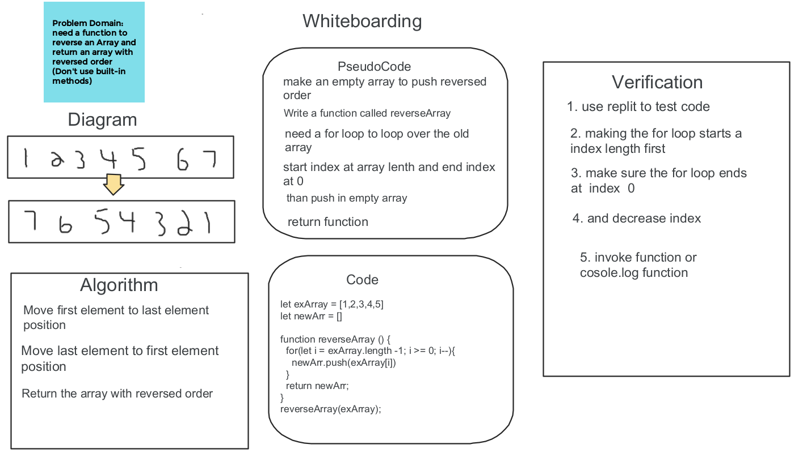

# Reverse an Array

 - Write a function called `reverseArray` which takes an array as an argument. Without utilizing any of the built-in methods available to your language, return an array with elements in reversed order.

## Whiteboard Process

 - 

## Approach & Efficiency

  -  We need an empty array to push the reversed order. We wrote a function called `reverseArray` with a for loop to loop over an array.  Switch the index starting point and ending and decrease the value `i--`. The `reverse()` method would have made this challenge easier to reverse the array

