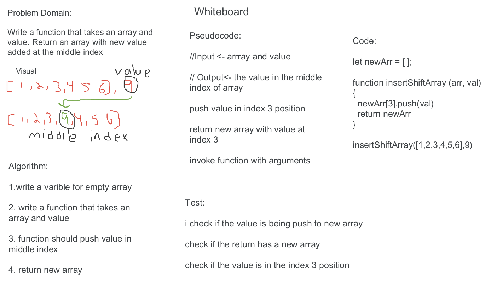

# Shift an Array

 - Write a function called `insertShiftArray` which takes in an array and a value to be added. Without utilizing any of the built-in methods available to your language, return an array with the new value added at the middle index.

## Whiteboard Process

 - 

## Approach & Efficiency

  1. write a varible for empty array

  2. write a function that takes an array and value

  3. function should push value in middle index

  4. return new array
