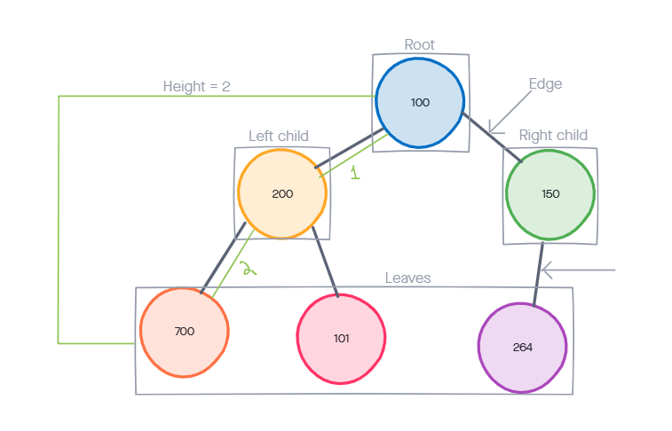

# Trees

- A tree is a widely used abstract data type that simulates a hierarchical tree structure, with a root value and subtrees of children with a parent node, represented as a set of linked nodes.

- A tree data structure can be defined recursively as a collection of nodes (starting at a root node), where each node is a data structure consisting of a value, together with a list of references to nodes (the "children"), with the constraints that no reference is duplicated, and none points to the root. [source](https://en.wikipedia.org/wiki/Tree_(data_structure))

- 

## Challenge 15

- New Implementation

## Features

### Node

- Create a Node class that has properties for the value stored in the node, the left  child node, and the right child node.

### Binary Tree

- Create a Binary Tree class
  - Define a method for each of the depth first traversals:
    - pre order
    - in order
    - post order which returns an array of the values, ordered appropriately.

### Binary Search Tree

- Create a Binary Search Tree class
    - This class should be a sub-class (or your languages equivalent) of the Binary Tree Class, with the following additional methods:
      - Add
        - Arguments: value
        - Return: nothing
        - Adds a new node with that value in the correct location in the binary search tree.
      - Contains
        - Argument: value
        - Returns: boolean indicating whether or not the value is in the tree at least once.

## Challenge 16

- Extending an Implementation

## Feature

### Maximum Value

- Write the following method for the Binary Tree class
  - find maximum value
  - Arguments: none
  - Returns: number

## Challenge 17

- Code Challenge / Algorithm

## Features

### Tree-Breadth-First

- Write a function called breadth first
  - Arguments: tree
  - Return: list of all values in the tree, in the order they were encountered

## Links

- [Binary Trees Javascript Code](binaryTrees.js)

